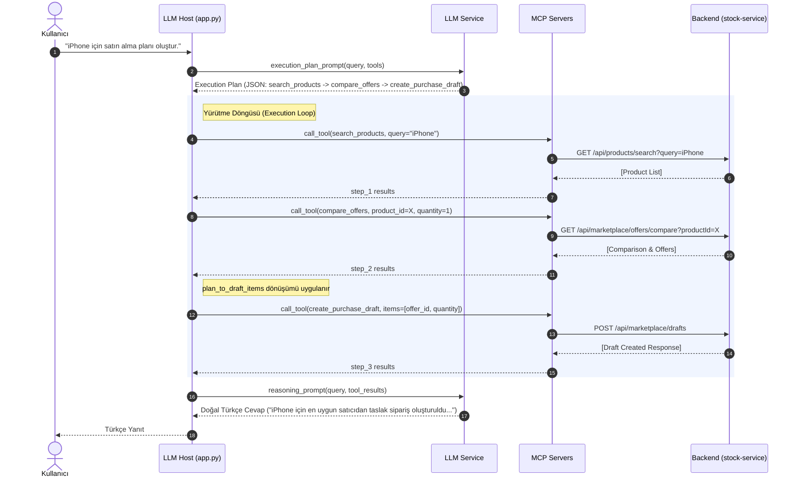
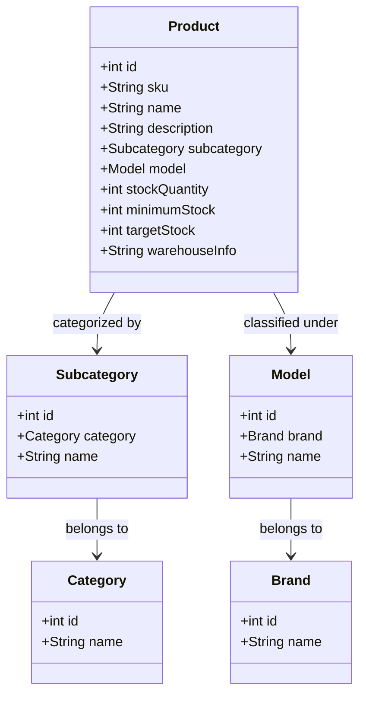
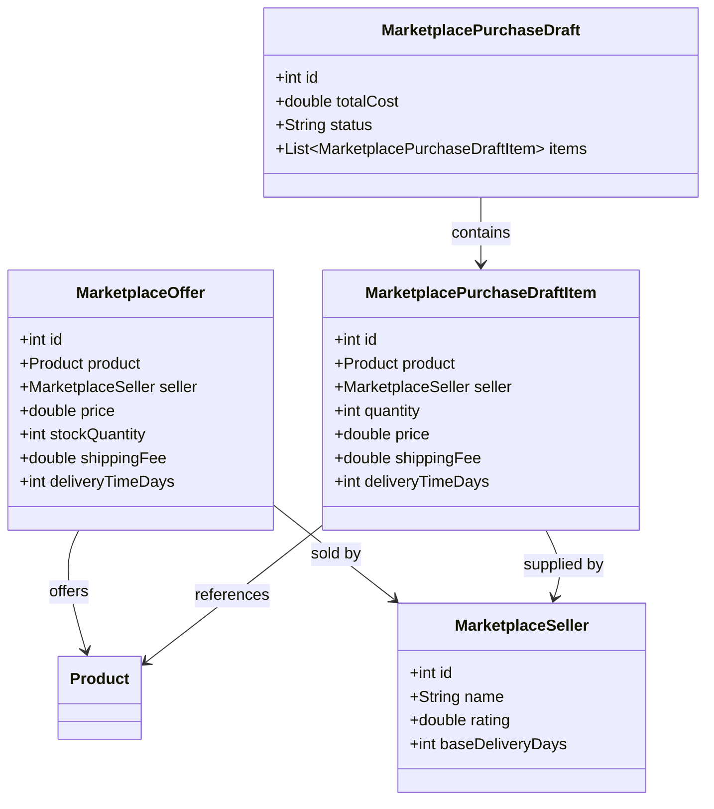

# Smart Stock & Procurement MCP System Documentation

Bu doküman, **Smart Stock & Procurement AI** sisteminin genel mimarisini, backend servislerini, Model Context Protocol (MCP) sunucularını, veri yapılarını ve LLM entegrasyonu (Orchestrator) uygulama detaylarını içermektedir.

---

## 1. Genel Mimari (General Architecture)

Sistem, yapay zekanın envanter kontrolü ve tedarik süreçlerini otomatize etmesini sağlayan 3 katmanlı (3-tier) bir mimariye sahiptir:

1. **Orchestrator / Client Katmanı (`llm-host`):** Kullanıcı isteklerini alır, LLM (Gemini) yardımıyla bir **çalıştırma planı (execution plan)** oluşturur, bu planı sırasıyla araçları (tools) çağırarak yürütür ve elde ettiği teknik sonuçları bir **akıl yürütme (reasoning)** aşamasından geçirerek kullanıcıya doğal Türkçe dilinde sunar.
2. **MCP Sunucu Katmanı (`stock-mcp` ve `marketplace-mcp`):** LLM'in kullanabileceği araçları (tools) tanımlayan ve stdio protokolü üzerinden Client ile haberleşen sunuculardır. Bu sunucular, gelen istekleri backend REST servislerine yönlendirir.
3. **Backend Servis Katmanı (`stock-service`):** Envanter, siparişler, tedarikçiler ve tekliflerle ilgili tüm iş mantığını (business logic) yöneten ve verileri saklayan Spring Boot uygulamasıdır.

### Mimari Bileşen Şeması

```mermaid
graph TD
    User([Kullanıcı / Arayüz]) <--> |Doğal Dil Sorgusu & Yanıt| LLMHost[LLM Orchestrator Layer: llm-host]
    
    subgraph LLM Host (MCP Client)
        LLMHost <--> |Gemini API| LLM[LLM Service / Reasoning Engine]
        LLMHost <--> |Stdio Transport| MCPClient[MCP Client Manager]
    end

    subgraph MCP Sunucuları (Araç Katmanı)
        MCPClient <--> |stdio| StockMCP[stock-mcp Server]
        MCPClient <--> |stdio| MarketplaceMCP[marketplace-mcp Server]
    end

    subgraph Backend Servis (İş Mantığı & Veri)
        StockMCP <--> |HTTP REST API| SpringBoot[Spring Boot Backend: stock-service]
        MarketplaceMCP <--> |HTTP REST API| SpringBoot
        SpringBoot <--> |Spring Data JPA| DB[(Veritabanı)]
    end
```

### İşlem Akış Diyagramı (Sequence Diagram)

Kullanıcının *"iPhone için satın alma planı oluştur"* gibi karmaşık bir istek göndermesi durumundaki süreç akışı aşağıda gösterilmiştir:



---

## 2. Backend Servisi (`stock-service`)

Spring Boot tabanlı backend servisi envanter yönetimini, tedarik karşılaştırmalarını ve sipariş oluşturma süreçlerini yönetir. Varsayılan olarak `http://localhost:8081` portu üzerinden hizmet vermektedir.

### REST API Uç Noktaları (Endpoints)

#### 1. Ürün & Stok Yönetimi (`ProductController`)
| Metot | URL / Endpoint | Açıklama |
| :--- | :--- | :--- |
| `GET` | `/api/products` | Sistemdeki tüm ürünlerin listesini döndürür. |
| `GET` | `/api/products/{id}` | Belirtilen ID'ye sahip ürün detaylarını döndürür. |
| `GET` | `/api/products/sku/{sku}` | SKU koduna göre ürün detaylarını getirir. |
| `GET` | `/api/products/search` | Ad, SKU, kategori vb. göre ürün araması yapar (parametre: `query`). |
| `GET` | `/api/products/out-of-stock` | Tamamen tükenmiş (stok adedi = 0) ürünleri listeler. |
| `GET` | `/api/products/low-stock` | Kritik stok seviyesinin altına düşen ürünleri getirir. |
| `GET` | `/api/products/replenishment` | İhtiyaç duyulan stok tamamlama (replenishment) miktarlarını hesaplar. |
| `POST` | `/api/products` | Yeni bir ürün tanımlar veya mevcut ürünü günceller. |
| `DELETE` | `/api/products/{id}` | Ürünü siler. |

#### 2. Gelen Siparişler (`OrderController`)
| Metot | URL / Endpoint | Açıklama |
| :--- | :--- | :--- |
| `GET` | `/api/orders` | Tüm gelen siparişleri listeler. |
| `GET` | `/api/orders/pending` | Henüz teslim alınmamış (bekleyen) siparişleri getirir. |
| `GET` | `/api/orders/{id}` | Belirli bir siparişin detaylarını getirir. |
| `POST` | `/api/orders` | Envanteri tamamlamak için yeni bir tedarik siparişi oluşturur. |
| `POST` | `/api/orders/{id}/receive` | Gelen siparişi teslim alındı olarak işaretler ve stok miktarını artırır. |

#### 3. Pazaryeri Entegrasyonu (`MarketplaceController`)
| Metot | URL / Endpoint | Açıklama |
| :--- | :--- | :--- |
| `GET` | `/api/marketplace/sellers` | Pazaryerindeki tüm aktif satıcıları (sellers) listeler. |
| `GET` | `/api/marketplace/offers` | Belirli bir ürün için veya serbest aramayla pazaryeri tekliflerini getirir. |
| `GET` | `/api/marketplace/offers/compare` | Belirli bir ürün için satıcı tekliflerini TOPSIS yöntemiyle karşılaştırır. |
| `GET` | `/api/marketplace/check-availability` | Belirli bir teklif ID'si ve adedi için stok uygunluğunu kontrol eder. |
| `POST` | `/api/marketplace/drafts` | Satın alma öncesi geçici bir sepet/taslak (`draft`) sipariş oluşturur. |
| `POST` | `/api/marketplace/orders` | Onaylanan taslağı gerçek bir siparişe dönüştürür. |
| `GET` | `/api/marketplace/orders/{orderId}` | Oluşturulan pazaryeri siparişinin detaylarını döndürür. |

---

## 3. MCP Sunucuları ve Sunulan Araçlar (Tools)

MCP (Model Context Protocol) sunucuları, Python dilinde yazılmış olup `mcp` kütüphanesini kullanır. Bu sunucular, Spring Boot API uç noktalarını soyutlayarak LLM'in çağırabileceği işlevsel araçlara (tools) dönüştürür.

### A. Stock MCP Server (`stock-mcp`)
Bu sunucu, iç envanter durumunun izlenmesi ve iç tedarik süreçlerinin yürütülmesi ile ilgili araçlar sunar.

*   `list_products`: Depodaki tüm ürünlerin konum, SKU ve stok durumunu listeler.
*   `search_products`: Depo içerisinde detaylı arama yapar.
*   `list_out_of_stock`: Depoda kalmamış ürünleri getirir.
*   `list_low_stock`: Kritik stok seviyesindeki ürünleri listeler.
*   `calculate_replenishment` / `get_stock_replenishment_needed`: Depoda eksilen ürünler için sipariş edilmesi gereken tahmini adetleri hesaplar.
*   `create_incoming_order`: Tedarikçiden gelecek yeni bir sipariş girişi oluşturur.
*   `receive_order`: Gelen siparişi depoya kabul ederek stokları günceller.

### B. Marketplace MCP Server (`marketplace-mcp`)
Bu sunucu, dış satıcılar, pazaryeri fiyat teklifleri ve en uygun satın alma planlamalarıyla ilgili araçlar sunar.

*   `list_sellers`: Satıcıları puan ve teslimat sürelerine göre filtreleyerek listeler.
*   `search_offers`: Pazaryeri tekliflerini ürün ID'si veya serbest arama terimiyle bulur.
*   `compare_offers`: Belirli bir ürün için teklifleri karşılaştırarak en uygununu belirler.
*   `check_availability`: Satıcının stok adetlerinin yeterliliğini kontrol eder.
*   `create_purchase_draft`: Seçilen tekliflerden bir taslak sipariş (sepet) hazırlar.
*   `place_order`: Taslağı onaylayarak satın alma siparişini tamamlar.
*   `get_order_status`: Siparişlerin durumunu takip eder.
*   `create_procurement_plan`: Çoklu ürün alımlarında, satıcıların fiyat, stok, kargo ve puanlarına göre matematiksel optimizasyon yapar.

#### Çok Kriterli Karar Verme (TOPSIS & Objectives)
Pazaryeri modülü, satın alma kararlarını optimize etmek için 4 farklı hedef stratejisi sunar:
1.  **CHEAPEST (En Ucuz):** Fiyat maliyetini (Birim Fiyat + Kargo Ücreti) önceliklendirir.
2.  **FASTEST (En Hızlı):** Teslimat süresinin minimum olmasını hedefler.
3.  **HIGHEST_RATED (En Yüksek Puanlı):** Satıcı puanı (rating) en yüksek olanlara öncelik verir.
4.  **BALANCED (Dengeli):** Fiyat, kargo, satıcı puanı ve hızı TOPSIS algoritması kullanarak dengeler ve en optimal skorlu satıcıyı seçer.

---

## 4. Uygulama Detayları ve Dinamik Planlama

Sistemin beyni olan `llm-host`, LLM ile MCP sunucuları arasında dinamik bir orkestrasyon kurar.

### Planlama Döngüsü (Execution Plan Loop)

1.  **Plan İstemi (Execution Plan Generation):**
    Kullanıcı talebi geldiğinde, `llm-host` eldeki tüm araçların listesini ve kuralları LLM'e göndererek bir `execution_plan` talep eder. LLM, bu isteğe yanıt olarak ardışık adımlardan oluşan bir JSON döndürür.
2.  **Dinamik Değişken Zincirleme (`$from`):**
    Adımlar birbirine bağımlı olabilir. Bir sonraki adım, bir önceki adımın çıktısındaki verilere ihtiyaç duyabilir. Bu durum JSON içerisinde `$from` yapısıyla çözülür:
    ```json
    {
      "id": "step_2",
      "tool": "compare_offers",
      "arguments": {
        "product_id": { "$from": "step_1.products.0.id" },
        "quantity": 1
      }
    }
    ```
    Orkestratör, `step_1` bittiğinde onun sonucundaki `products[0].id` değerini otomatik olarak okur ve `step_2` parametresine yerleştirir.

3.  **Veri Dönüştürücüler (`$transform`):**
    Bir adımın çıktısı, bir sonraki aracın beklediği veri yapısına uymuyorsa, orkestratör aşağıdaki python dönüşüm fonksiyonlarını uygular:
    *   `replenishments_to_items`: Stok yenileme ihtiyaç listesini satın alma planı girdi formatına (`product_id`, `quantity`) dönüştürür.
    *   `plan_to_draft_items`: Optimize edilmiş tedarik planını sepet/taslak formatına (`offer_id`, `quantity`) getirir.
    *   `out_of_stock_products_to_items`: Stokta kalmayan ürünleri hedef stok seviyelerine göre hesaplayıp plan girdi formatına dönüştürür.

4.  **Akıl Yürütme (Reasoning Layer):**
    Tüm adımlar başarıyla tamamlandıktan sonra, toplanan ham veriler kullanıcı sorgusuyla birlikte LLM'e (Reasoning Engine) gönderilir. LLM bu verileri yorumlayarak Türkçe dilinde anlaşılır bir özet sunar.

---

## 5. Veri Yapıları (Data Structures)

Sistem genelinde katmanlar arası veri transferlerinde (DTO) ve veritabanı kayıtlarında kullanılan temel veri modelleri:

### A. Ürün ve Kategori Yapısı



### B. Satın Alma ve Teklif Yapısı



### Modellerin Ayrıntılı Öznitelikleri

#### 1. Product (Ürün)
*   `id` (Integer): Benzersiz sistem ID'si.
*   `sku` (String): Stok Kodu.
*   `name` (String): Ürün Adı.
*   `stockQuantity` (Integer): Depodaki güncel stok adedi.
*   `minimumStock` (Integer): Kritik stok sınırı (bu sınır ve altına düşüldüğünde ikmal tetiklenir).
*   `targetStock` (Integer): Hedeflenen ideal stok seviyesi.
*   `warehouseInfo` (String): Depo lokasyon bilgisi.

#### 2. Replenishment (İkmal Durumu)
Ürün stok yenileme ihtiyacını göstermek için hesaplanan geçici veri yapısıdır.
*   `productId` (Integer)
*   `sku` (String)
*   `productName` (String)
*   `categoryName` (String)
*   `stockQuantity` (Integer)
*   `minimumStock` (Integer)
*   `targetStock` (Integer)
*   `pendingIncomingQuantity` (Integer): Yoldaki/bekleyen gelen sipariş miktarı.
*   `replenishmentQuantityNeeded` (Integer): İhtiyaç duyulan sipariş miktarı (`targetStock - stockQuantity - pendingIncomingQuantity`).

#### 3. MarketplaceOffer (Pazaryeri Teklifi)
*   `id` (Integer): Teklif ID'si.
*   `product` (Product): Teklif edilen envanter ürünü.
*   `seller` (MarketplaceSeller): Teklifi veren satıcı.
*   `price` (Double): Birim satış fiyatı.
*   `stockQuantity` (Integer): Satıcının elindeki stok miktarı.
*   `shippingFee` (Double): Kargo/teslimat ücreti.
*   `deliveryTimeDays` (Integer): Teslimat süresi (gün).

#### 4. MarketplacePurchaseDraft (Satın Alma Sepet Taslağı)
*   `id` (Integer): Taslak ID'si.
*   `totalCost` (Double): Kargo dahil toplam sepet tutarı.
*   `status` (String): Taslak durumu (`DRAFT`, `ORDERED`, `CANCELLED`).
*   `items` (List): Taslakta yer alan kalemlerin detayları.

---

## 6. Installation & Setup Guide

Follow the steps below to configure and run the Smart Stock & Procurement MCP system in your local environment.

### Prerequisites
- **Java 21** or higher
- **Maven 3.9** or higher
- **Python 3.14** or higher
- **PostgreSQL 17** database server

---

### Step 1: Database Configuration (PostgreSQL)
1. Create a database named `smart_stock` in your PostgreSQL server.
2. Open `stock-service/src/main/resources/application.yml` and update the datasource credentials with your local PostgreSQL configurations:
   ```yaml
   spring:
     datasource:
       url: jdbc:postgresql://localhost:5432/smart_stock
       username: <your_username>
       password: <your_password>
   ```

### Step 2: Build and Run Spring Boot Backend
Open a terminal, navigate to the `stock-service` directory, build the project and run it:
```bash
cd stock-service
mvn clean install
mvn spring-boot:run
```
The backend service will start and be available at `http://localhost:8081`. The database schema and seed data (defined in `data.sql`) will be initialized automatically.

### Step 3: Install Python Dependencies
Navigate back to the project root directory and install all required Python packages for `llm-host`, `stock-mcp`, and `marketplace-mcp` with a single command:
```bash
pip install -r llm-host/requirements.txt -r stock-mcp/requirements.txt -r marketplace-mcp/requirements.txt
```

### Step 4: Configure LLM Integration
Open `llm-host/llm.py` and configure the `self.url` endpoint with your active LLM API server endpoint (e.g. a local LLM runner or a Cloudflare/ngrok tunnel URL).

### Step 5: Start the Orchestrator Client
Navigate to the `llm-host` directory and launch the interactive client orchestrator:
```bash
cd llm-host
python app.py
```
Once connected, you can interact with the system using natural-language commands in the terminal.


